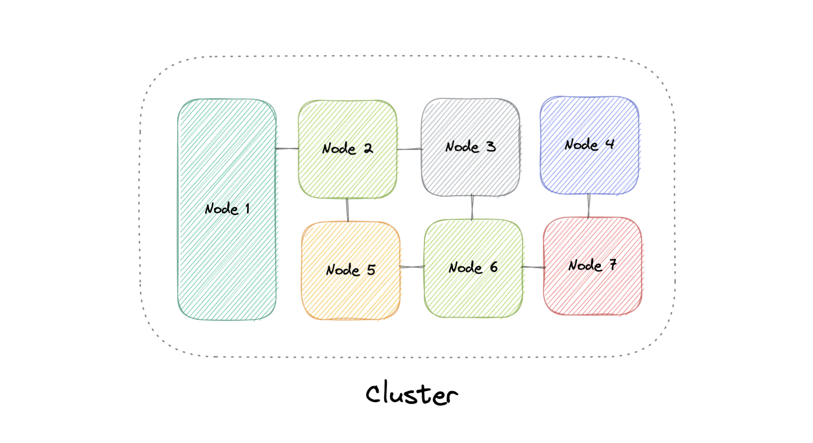

# Clustering

At a high level, a computer cluster is a group of two or more computers, or nodes, that run in parallel to achieve a common goal. This allows workloads consisting of a high number of individual, parallelizable tasks to be distributed among the nodes in the cluster. As a result, these tasks can leverage the combined memory and processing power of each computer to increase overall performance.

To build a computer cluster, the individual nodes should be connected to a network to enable internode communication. Software can then be used to join the nodes together and form a cluster. The cluster may include a shared storage device and/or local storage on each node.

## Cluster

Typically, at least one node is designated as the leader node and acts as the entry point to the cluster. The leader node may be responsible for delegating incoming work to the other nodes and, if necessary, aggregating the results and returning a response to the user.

Ideally, a cluster functions as if it were a single system. A user accessing the cluster should not need to know whether the system is a cluster or an individual machine. Furthermore, a cluster should be designed to minimize latency and prevent bottlenecks in node-to-node communication.

## Types of Clusters

Computer clusters can generally be categorized into three types:
- **Highly available or fail-over**
- **Load balancing**
- **High-performance computing (HPC)**

## Configurations

The two most commonly used high availability (HA) clustering configurations are active-active and active-passive.

### Active-Active Clusters

An **active-active** cluster is typically made up of at least two nodes, both actively running the same kind of service simultaneously. The main purpose of an active-active cluster is to achieve **load balancing**. A load balancer distributes workloads across all nodes to prevent any single node from being overloaded. Since multiple nodes are available to handle requests, there is typically an improvement in throughput and response times.

### Active-Passive Clusters

In an **active-passive** cluster, like the active-active configuration, there are at least two nodes. However, not all nodes are active simultaneously. For example, in a two-node configuration, if one node is active, the second node remains passive or in standby mode. This setup is often used for **failover** purposes, where the passive node can take over in the event the active node fails.

## Advantages of Clustering

Four key advantages of cluster computing include:

- **High availability**: Ensures systems are always available, even in the event of a node failure.
- **Scalability**: Allows easy scaling by adding more nodes to the cluster as demand grows.
- **Performance**: Distributes workloads efficiently across nodes to improve performance.
- **Cost-effectiveness**: Allows the use of commodity hardware while still achieving high levels of performance.

## Load Balancing vs Clustering

While clustering and load balancing share similarities, they serve different purposes. Clustering offers **redundancy** and enhances **capacity** and **availability** by making the nodes in a cluster aware of each other, working together towards a common goal. Load balancing, on the other hand, distributes requests across servers, but the servers are not aware of each other. They simply handle the requests passed by the load balancer.

You can use load balancing in conjunction with clustering, but load balancing is also applicable for independent servers that share a common purpose, such as running websites, applications, or IT resources.

## Challenges of Clustering

Some challenges of clustering include:

1. **Increased complexity**: Installing and maintaining a cluster involves setting up the operating system, applications, and their dependencies on every node. This complexity grows if the nodes are not homogeneous.
   
2. **Monitoring**: Resource usage on each node must be closely monitored, and logs need to be aggregated to ensure proper functioning of the system.
   
3. **Storage management**: Shared storage must be carefully handled to prevent nodes from overwriting each other’s data, and distributed data stores must remain synchronized across nodes.

## Examples of Clustering in Industry

Clustering is widely used across various technologies, including:

- **Containers** (e.g., Kubernetes, Amazon ECS)
- **Databases** (e.g., Cassandra, MongoDB)
- **Caching systems** (e.g., Redis, Memcached)
